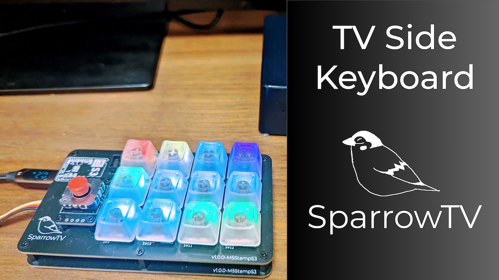

# TV Side Keyboard SparrowTV

> TV Side Keyboard SparrowTV | ProtoPedia
>
> https://protopedia.net/prototype/4340

> (530) Introduce TV Side Keyboard SparrowTV - YouTube
>
> https://www.youtube.com/watch?v=BaXQt75BodM

この作品は M5Stack Japan Creativity Contest 2023 に応募しています。

## Product versions

### v1.0.0

#### BOM

| Reference | Name                               | Quantity |
| --------- | ---------------------------------- | -------- |
| CH1       | HY2.0 Socket SMD 4Pin - JoyPoint   | 1        |
| CH2       | HY2.0 Socket SMD 4Pin - M5 IR Unit | 1        |
| D1-D12    | Diode SMD D                        | 12       |
| D13-D24   | RGBLED 3528 SK6812MINI-E           | 12       |
| J1        | Box Pin Header 2x3 Pitch 1.27mm    | 1        |
| R1        | Capacitor 0805 27F                 | 1        |
| R2, R3    | Capacitor 0805 10kF                | 2        |
| SW1-SW12  | Kailh Choc Switch Socket           | 12       |
| U1        | MCU Module ESP32-S3                | 1        |

## License

MIT

日本では販売しないでいただけると助かります。
