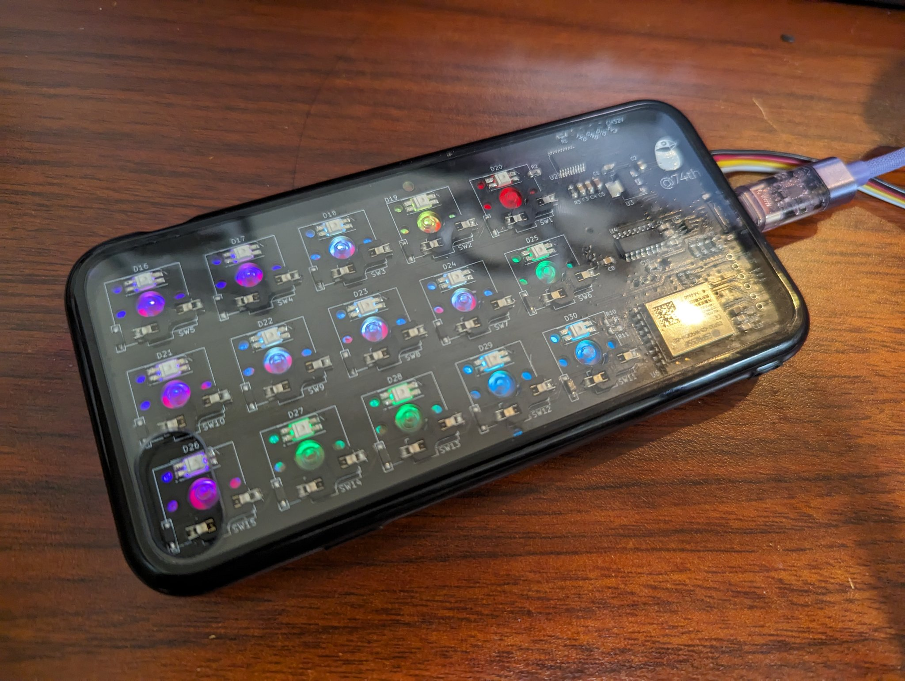

# TV Side Keyboard SparrowTV

> TV Side Keyboard SparrowTV | ProtoPedia
>
> https://protopedia.net/prototype/4340

> (530) Introduce TV Side Keyboard SparrowTV - YouTube
>
> https://www.youtube.com/watch?v=BaXQt75BodM

この作品は M5Stack Japan Creativity Contest 2023 に応募していました。

ESP32-S3 の USB デバイス機能が使いこなせなかった（USB キーボードでスリープ復帰ができないのを解決できなかった）ので、USB デバイスとして CH9329 を利用し、さらに ESP32-C3 に置き換えました。

## Product versions

### v1.2.0

- ESP32-S3 を ESP32-C3 に置き換え。
- USB キーボードのための IC として CH9329 を利用。
- キーボードマトリックス、ジョイスティックの読み込みに CH32V003F4P6 を利用（v1.0.0 ではジョイスティックのみであった）。

#### Documents

- semantics [pdf](./pcb-kicad/tv-side-keyboard_v1.2.0_semantics.pdf) [kicanvas](https://kicanvas.org/?github=https%3A%2F%2Fgithub.com%2F74th%2Ftv-side-keyboard-SparrowTV%2Fblob%2Fv1.2.0%2Fpcb-kicad%2Ftv-side-keyboard.kicad_sch)
- pcb [kicanvas](https://kicanvas.org/?github=https%3A%2F%2Fgithub.com%2F74th%2Ftv-side-keyboard-SparrowTV%2Fblob%2Fv1.2.0%2Fpcb-kicad%2Ftv-side-keyboard.kicad_pcb)

#### BOM

| Reference                    | Name                                        | Quantity |
| ---------------------------- | ------------------------------------------- | -------- |
| C1, C2                       | Capacitor 0805 10uF                         | 2        |
| C3, C4, C6, C8-C10, C12, C13 | Capacitor 0805 100nF                        | 8        |
| C5, C7, C11                  | Capacitor 0805 1uF                          | 3        |
| CH1                          | HY2.0 Socket SMD 4Pin - M5 IR Unit          | 1        |
| D1-D15                       | Diode SMD 1N4148W                           | 15       |
| D16-D30                      | RGBLED 3528 SK6812MINI-E                    | 15       |
| J1                           | USB Type-C Receptacle                       | 1        |
| J2                           | Box Pin Header 2x3 Pitch 1.27mm             | 1        |
| R1                           | Register 0805 1Ω                            | 1        |
| R2                           | Register 0805 27Ω                           | 1        |
| R3, R4, R8, R9               | Register 0805 10kΩ                          | 4        |
| R5                           | Register 0805 42-56kΩ                          | 1        |
| R6, R7                       | Register 0805 5.1kΩ                         | 2        |
| R10, R11                     | Register 0805 1kΩ                           | 2        |
| SW1-SW15                     | Kailh Choc Switch Socket                    | 15       |
| U1                           | Joystick B10K                               | 1        |
| U2                           | MCU TSSOP20 WCH CH32V003F4P6                | 1        |
| U3                           | Regulator 3.3V SOT-223 AMS1117-3.3          | 1        |
| U4                           | USB Keyboard Mouse Device IC SOIC-16 CH9329 | 1        |
| U5                           | USB Power Protection IC SOT-23-6L CH217K    | 1        |
| U6                           | WiFi MCU Module ESP32-C3-WROOM-02           | 1        |

### v1.0.0

- semantics: [PDF](pcb-kicad/tv-side-keyboard_v1.0.0_semantics.pdf) [kicanvas](https://kicanvas.org/?github=https%3A%2F%2Fgithub.com%2F74th%2Ftv-side-keyboard-SparrowTV%2Fblob%2Fv1.0.0%2Fpcb-kicad%2Ftv-side-keyboard.kicad_sch)
- pcb: [kicanvas](https://kicanvas.org/?github=https%3A%2F%2Fgithub.com%2F74th%2Ftv-side-keyboard-SparrowTV%2Fblob%2Fv1.0.0%2Fpcb-kicad%2Ftv-side-keyboard.kicad_pcb)

#### BOM

| Reference | Name                               | Quantity |
| --------- | ---------------------------------- | -------- |
| CH1       | HY2.0 Socket SMD 4Pin - JoyPoint   | 1        |
| CH2       | HY2.0 Socket SMD 4Pin - M5 IR Unit | 1        |
| D1-D12    | Diode SMD 1N4148W                  | 12       |
| D13-D24   | RGBLED 3528 SK6812MINI-E           | 12       |
| J1        | Box Pin Header 2x3 Pitch 1.27mm    | 1        |
| R1        | Capacitor 0805 27F                 | 1        |
| R2, R3    | Capacitor 0805 10kF                | 2        |
| SW1-SW12  | Kailh Choc Switch Socket           | 12       |
| U1        | MCU Module M5Stamp S3              | 1        |

## License

MIT

日本では販売しないでいただけると助かります。
